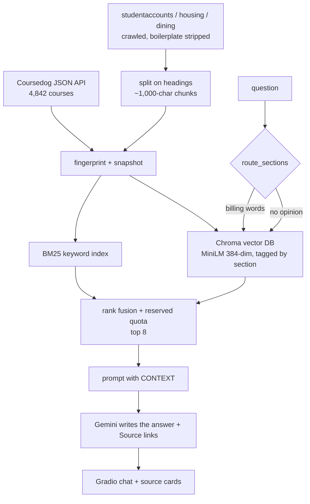

# ISU Campus Assistant

A retrieval-augmented generation (RAG) prototype that answers questions about **Illinois State
University courses, billing, housing and dining** — grounded in the university's own catalog API and
websites, with a link back to every source page.

---

## Quickstart

1. Open `notebooks/ISU-CampusAssistant-RAG-Demo.ipynb` in Google Colab.
2. Get a free API key at [aistudio.google.com/apikey](https://aistudio.google.com/apikey).
3. In Colab, click the 🔑 key icon → **Add new secret** → name it `GOOGLE_API_KEY`, paste the key,
   turn **Notebook access** on.
4. **Run the `check_sources()` cell in §3 first.** It fetches each seed once and prints whether the
   site responded, whether robots.txt allows it, and how much text was extracted. Thirty seconds
   here saves a ten-minute crawl that collects nothing.
5. **Runtime → Run all.**

The last cell embeds the chat app in the notebook output and prints a public `gradio.live` link.

Without an API key the app still runs: it shows the retrieved pages with their links, but no written
answer.

---

## What it does

| Stage | What happens | Where |
|---|---|---|
| **Collect (catalog)** | Pages through the catalog's Coursedog JSON API, 200 courses per request | `collect_catalog()` |
| **Collect (web)** | Crawls the billing, housing and dining sites — robots.txt obeyed, one section per seed host | `collect_website()` |
| **Preprocess** | Strips HTML, nav and footers; flattens course records; writes one text document per course and per page section | `clean()`, `to_record()`, `extract_page()` |
| **Chunk** | Courses stay whole; web pages split on headings into ~1,000-character overlapping chunks | `to_document()`, `split_text()` |
| **Sync** | Fingerprints every chunk and diffs against the last snapshot — added / updated / removed | `diff_documents()` |
| **Index** | Embeds everything with MiniLM into one Chroma collection tagged by section, plus a BM25 index | `CatalogIndex.build()` |
| **Route** | Billing/housing/dining wording reserves half the retrieval slots for that section | `route_sections()` |
| **Retrieve** | BM25 and Chroma rank independently; reciprocal rank fusion merges them; top 8 go forward | `CatalogIndex.search()` |
| **Augment** | Those 8 chunks are pasted into the prompt under a `CONTEXT` header | `Answerer.build_prompt()` |
| **Generate** | Gemini answers from that context only, citing pages as markdown links | `Answerer.answer_stream()` |
| **Publish** | Corpus and vector database push to a Hugging Face dataset repo | `publish_to_hub()` |



---

## Is this actually RAG?

Yes, and the three stages are each one function. **Retrieve**: the question is scored against every
chunk and the top 8 come back. **Augment**: those 8 are placed in the prompt. **Generate**: Gemini
writes the answer with an instruction to use nothing else.

Nothing is trained or fine-tuned. Gemini is an off-the-shelf instruction-tuned model with no
ISU-specific knowledge — everything it knows about the university arrives in the prompt at question
time. That is the argument for RAG here: tuition dates, room rates and meal plan prices change every
term, and a fine-tuned model would be stale the day it finished training.

---

## Data, chunking and the vector store

**Two chunking strategies, on purpose.**

- *Courses* are one chunk each. They are already short (median 481 characters) and self-contained, so
  splitting them would break a course apart and cost the source cards the ability to cite one code.
- *Web pages* are long and cover several topics, so each `(heading, text)` block is split into
  ~1,000-character pieces on sentence boundaries with 150 characters of overlap. Every chunk carries
  its page title, heading, URL and the date it was fetched, so a retrieved fragment can still be
  cited and still reads sensibly alone.

**Vector database: [Chroma](https://www.trychroma.com/)**, a `PersistentClient` writing to
`isu_catalog_cache/chroma/`. One collection holds everything, each record tagged with its `section`
(`courses`, `billing`, `housing`, `dining`) so the UI dropdown and the router can filter inside the
database with `where={"section": {"$in": [...]}}`. Each record stores its fingerprint, so a re-sync
upserts only what changed and deletes what left.

**Embeddings:** `sentence-transformers/all-MiniLM-L6-v2` — 384 dimensions, ~22.7M parameters, runs on
the Colab CPU. Vectors are L2-normalized; the collection uses cosine distance to match.

**Where it lives:** Colab wipes its filesystem on disconnect, so `publish_to_hub()` pushes the corpus
and the Chroma store to a Hugging Face dataset repo, and `restore_from_hub()` pulls them back on a
fresh runtime without re-embedding.

---

## Crawling politely

- `robots.txt` is parsed per host and obeyed.
- Each section stays inside its seed's host and path prefix, so a link to the university home page
  cannot pull all of `www.illinoisstate.edu` into "billing".
- A delay between requests, a page cap and a depth cap per section.
- The crawler identifies itself honestly in its `User-Agent` rather than impersonating a browser.
- URLs with query strings, and non-HTML files, are skipped.
- Nothing behind a login is touched.

---

## Why there is a router

The catalog contributes 4,842 chunks; the three websites contribute a few hundred. Left to a single
global ranking, a billing question loses to courses with words like *cost*, *payment* and *housing
markets* in their descriptions.

So when the dropdown is on **Everything**, `route_sections()` looks for section vocabulary in the
question and reserves half the slots for the matching section. Matching is whole-word with an
optional plural — plain substring matching finds "eat" inside "w**eat**her", and strict boundaries
miss "meal plan**s**". The dropdown remains available as a hard filter.

---

## Accuracy and what it will not do

- Dollar amounts, rates and deadlines must be quoted from `CONTEXT`, attributed to their page, and
  given with the "Last checked" date carried in the chunk. Source cards show that date too.
- **It cannot see anyone's account.** Balances, charges, housing assignments and meal swipes live
  behind MyIllinoisState. The assistant explains the process and links the page; it never states a
  personal figure.
- No prerequisite graph — prerequisites are free text that nothing parses into a chain.
- Aggregate counts are unreliable beyond the per-subject fact injected into the prompt.
- MiniLM truncates at 256 tokens, so the longest chunks are embedded from their opening portion;
  BM25 still indexes their full text.
- The Coursedog API is public but undocumented, and the websites are ordinary HTML. Either can change
  shape without notice.

---

## Configuration

| Setting | Default | Controls |
|---|---|---|
| `WEB_SOURCES` | billing / housing / dining | Which sites to crawl, and the section each one becomes |
| `CRAWL_MAX_PAGES` | 120 | Pages per section. Start at 25 on a first run |
| `CRAWL_MAX_DEPTH` | 3 | Links away from the seed |
| `CRAWL_PAUSE` | 0.5 s | Delay between requests |
| `CHUNK_CHARS` / `CHUNK_OVERLAP` | 1000 / 150 | Web page chunk size and overlap |
| `TOP_K` | 8 | Chunks sent to the model |
| `SHOW_SOURCES` | 5 | Source cards under an answer |
| `EMBED_MODEL` | `all-MiniLM-L6-v2` | Embedding model |
| `COLLECTION_NAME` | `isu_courses` | Chroma collection, cosine space |
| `GEMINI_MODEL` | `None` | `None` auto-picks the newest Flash the key can see |
| `HF_DATASET_REPO` | `None` | Set to `user/repo` to publish |
| `USE_DRIVE` | `False` | `True` keeps the cache in Google Drive |

Adding a section is two lines: an entry in `WEB_SOURCES` and a label in `SECTION_CHOICES`.

---

## Project structure

```
.
├── notebooks/
│   └── ISU-CampusAssistant-RAG-Demo.ipynb   the whole prototype, top to bottom
├── assets/                                  screenshots
├── docs/                                    written documentation
├── requirements.txt
└── README.md
```

---

## Attribution

Course text and page content are published by Illinois State University and retrieved from its
public API and websites. This is a student project, not an official ISU product.
