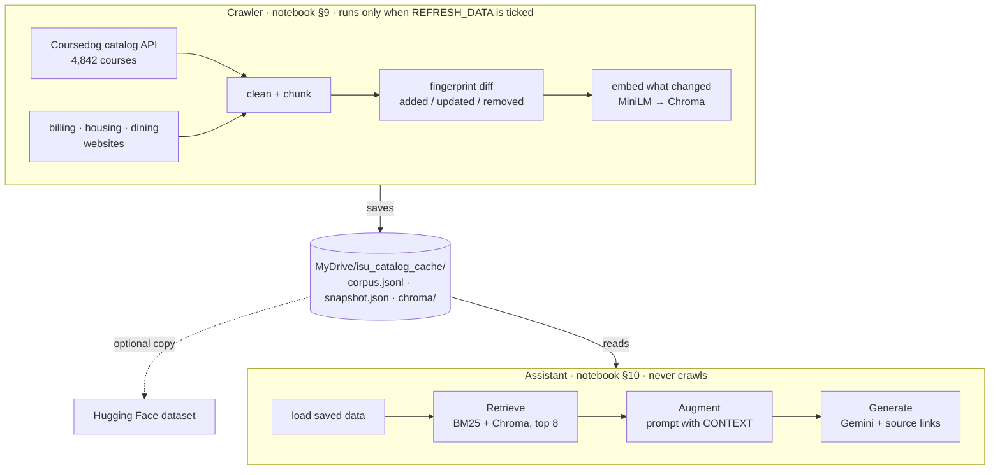

# ReggieBot: the ISU Campus Assistant

A retrieval-augmented generation (RAG) assistant that answers questions about **Illinois State
University courses, billing, housing and dining**. Answers are grounded in the university's own
course catalog and websites, and every answer lists the pages it came from.

[](https://colab.research.google.com/github/YOUR-USERNAME/isu-campus-assistant/blob/main/notebooks/ISU-CampusAssistant-RAG-Demo.ipynb)

<!-- Replace YOUR-USERNAME in the badge above with your GitHub username.
     To show a screenshot, save one as assets/screenshot.png and uncomment the next line. -->
<!--  -->

- **Corpus:** 4,842 active courses from the catalog's JSON API, plus pages crawled from the
  Student Accounts, Housing and Dining websites.
- **Retrieval:** BM25 keyword search and MiniLM vector search over a Chroma database, merged with
  reciprocal rank fusion.
- **Generation:** Google Gemini (free API key), told to answer only from the retrieved text.
- **Interface:** ReggieBot, a Gradio chat app in ISU red and white, with starter questions and source
  links under every answer.
- **Experiment:** Arm 1 scores the system on 50 labeled questions.
- **Runs in:** Google Colab, top to bottom, with everything saved to your Google Drive.

---

## Quickstart

### First run

1. Open `notebooks/ISU-CampusAssistant-RAG-Demo.ipynb` in Google Colab (the badge above does this).
2. Get a free Gemini API key at [aistudio.google.com/apikey](https://aistudio.google.com/apikey).
3. In Colab, click the 🔑 **key icon** in the left sidebar → **Add new secret** → name it
   `GOOGLE_API_KEY`, paste the key, and turn **Notebook access** on.
4. In the crawler cell (§9), tick **`REFRESH_DATA`**.
5. **Runtime → Run all.** The configuration cell (§1) asks for permission to use your Google Drive;
   allow it. Everything the notebook saves goes to `MyDrive/isu_catalog_cache`, so it survives a
   runtime reset.

The crawler fetches the catalog, crawls the three websites and builds the vector database. Expect
roughly 5–12 minutes the first time, most of it spent politely crawling. The assistant cell (§10)
then opens ReggieBot in the notebook and prints a public `gradio.live` link.

### Every run after that

Untick `REFRESH_DATA` and **Run all**. The crawler cell is skipped, and the assistant loads the saved
data from Drive in seconds without making a single catalog or website request.

### Refreshing the data

Tick `REFRESH_DATA` and run §9, or press **Check catalog for updates** inside the app. The crawler
compares fingerprints with the last run, reports what was added, updated or removed, and re-embeds
only the chunks that changed.

> **No API key?** The app still runs. It shows the closest matching courses and pages with their
> links, just without a written answer.

---

## How it works

The project is two programs that share one folder on Drive. The **crawler** is the only part that
touches the network for data; the **assistant** only reads what the crawler saved.



| Stage | What happens | Code |
|---|---|---|
| **Collect (catalog)** | Pages through the catalog's Coursedog JSON API, 200 courses per request | `collect_catalog()`, `fetch_courses()` |
| **Collect (web)** | Crawls the billing, housing and dining sites, obeying `robots.txt` | `collect_website()`, `crawl_section()` |
| **Preprocess** | Strips HTML, navigation and footers; flattens course records | `clean()`, `to_record()`, `extract_page()` |
| **Chunk** | Courses stay whole; web pages are split into ~1,000-character overlapping chunks | `to_document()`, `split_text()`, `web_document()` |
| **Diff** | Fingerprints every chunk and compares against the last run | `fingerprint()`, `diff_documents()` |
| **Index** | Embeds new and changed chunks into Chroma; builds a BM25 keyword index | `CatalogIndex.build()` |
| **Save** | Writes the corpus, snapshot and vector DB to the cache folder on Google Drive | `save_snapshot()`, `save_chroma_to_drive()` |
| **Load** | The assistant's startup: reads the saved data, makes no requests | `CatalogApp.load()` |
| **Route** | Billing, housing or dining wording reserves half the slots for that section | `route_sections()` |
| **Retrieve** | BM25 and Chroma rank separately; rank fusion merges them; top 8 go forward | `CatalogIndex.search()` |
| **Augment** | Those 8 chunks are pasted into the prompt under a `CONTEXT` header | `Answerer.build_prompt()` |
| **Generate** | Gemini answers from that context only | `Answerer.answer_stream()` |
| **Show sources** | The pages the answer used are listed under it | `with_sources()` |
| **Publish** | Optionally pushes the corpus and vector DB to a Hugging Face dataset repo | `publish_to_hub()` |

---

## Is this actually RAG?

Yes. Retrieval, augmentation and generation are each one function. The question is scored against
every chunk and the top 8 come back (`search()`), those 8 are placed in the prompt
(`build_prompt()`), and Gemini writes the answer with an instruction to use nothing else
(`answer_stream()`).

Nothing is trained or fine-tuned. Gemini and MiniLM are used exactly as published, and everything
the system knows about ISU arrives in the prompt at question time. That is the case for RAG here:
course descriptions, tuition deadlines, room rates and meal plan prices change every term, and a
re-crawl updates the database in minutes where a fine-tuned model would be stale the day it finished
training.

---

## The interface

ReggieBot is a single centred column: the header, a status strip (catalog, chunk counts, when the data
was last crawled), the chat, the question box, five starter questions, and a **Check catalog for
updates** button.

When an answer finishes, a short list is added underneath it:

- **Sources** lists the retrieved pages the answer actually used: courses it names and pages it
  links, each page once, up to 5.
- If the answer names nothing (for example "I can't see your balance"), the list is titled
  **Closest matches in the catalog** and shows up to 3 pages, so it never claims a source it didn't use.
- Gemini's own closing "Source:" line is replaced by the list, so links don't appear twice.

There is no section dropdown: the keyword router decides for every question (see below).

---

## Data, chunking and the vector store

**Two chunking strategies, on purpose.**

- *Courses* are one chunk each. They are already short (median 481 characters, max 1,388) and
  self-contained, so splitting them would separate a prerequisite from its course code.
- *Web pages* are long and cover several topics, so each heading's text is split into
  ~1,000-character pieces on sentence boundaries, with 150 characters of overlap. Every chunk keeps
  its page title, heading, URL and the date it was fetched, so it can be cited on its own.

**Vector database: [Chroma](https://www.trychroma.com/).** A persistent store saved in
`isu_catalog_cache/chroma/`, one collection (`isu_courses`, cosine distance). Every record is tagged
with its `section` (`courses`, `billing`, `housing`, `dining`), so the router can filter inside the
database. Every record also stores its fingerprint, so a refresh upserts only what changed and deletes
what disappeared.

**Embeddings:** `sentence-transformers/all-MiniLM-L6-v2`: 384 dimensions, about 22.7 million
parameters, runs on Colab's CPU.

**Where the data is saved.** Colab wipes its disk when the runtime ends, so everything is saved to
Google Drive:

```
MyDrive/isu_catalog_cache/
├── corpus.jsonl          every chunk: id, text, metadata
├── snapshot.json         fingerprints for change detection, plus the catalog details
├── chroma/               the Chroma vector database
└── experiments/
    ├── arm1/             questions, results, summary and write-up for Arm 1
    └── arm1_results.zip
```

Chroma keeps its index in SQLite, which needs file locking that Google Drive's mount doesn't reliably
provide. So while the notebook runs, Chroma is opened from a local working copy
(`/content/chroma_working_copy`), and the store is copied back to `MyDrive/isu_catalog_cache/chroma/`
after every change. A fresh runtime copies it down from Drive again, so nothing is re-embedded.

| Setting | Where the cache lives |
|---|---|
| `DRIVE_MODE = "drive"` (default) | `MyDrive/isu_catalog_cache` (change `DRIVE_FOLDER` to move it) |
| `DRIVE_MODE = "off"` | Colab's local disk only; lost when the runtime resets |
| `publish_to_hub()` | Also pushed to a Hugging Face dataset repo: set `HF_DATASET_REPO` and add an `HF_TOKEN` secret |

---

## When Gemini says it's busy

Free-tier Gemini models get overloaded at peak hours, and the free quota runs out. The app tells these
apart and handles each one differently, so a raw error never appears in the chat.

| Failure | Typical code | What the app does |
|---|---|---|
| Busy | 503 | Retries the same model after 1.5 s, 3 s and 6 s, then moves to the next model |
| Quota used up | 429 | Skips straight to the next model, since retrying only burns more quota |
| Rejected | 400 / 403 | Skips to the next model |

At startup, `rank_models()` builds a fallback chain of up to three models, one per tier (Flash,
Flash-Lite, Pro), because models in the same tier share capacity. `probe_models()` sends each one a
one-word test and drops any your key can't use. If every model fails, the chat shows the matching
sources with a one-line explanation. A partial answer that was already streaming is kept.

Still stuck? Run the **Troubleshooting Gemini** cell (`gemini_report()`). It tests each model and
prints `OK`, `BUSY`, `QUOTA` or `PERMANENT`. Setting `GEMINI_MODEL = "gemini-flash-lite-latest"` in §1
is the usual fix for a Flash tier that is constantly busy.

---

## Crawling politely

- `robots.txt` is read for every host and obeyed.
- Each section stays on its own seed host, so a link to the university home page can't pull all of
  `www.illinoisstate.edu` into "billing".
- Each section has a page cap (120), a depth cap (3) and a half-second delay between requests.
- The crawler names itself in its `User-Agent` instead of pretending to be a browser.
- URLs with query strings, and non-HTML files, are skipped.
- Nothing behind a login is touched.

Before a full crawl, `check_sources()` fetches each starting page once and prints whether it responded,
whether `robots.txt` allows it and how much text came out. Thirty seconds there can save a ten-minute
crawl that collects nothing.

---

## Why there is a router

The catalog contributes 4,842 chunks and the three websites contribute a few hundred. In a single
ranking, a billing question can lose to course descriptions that happen to mention *cost* or
*payment*.

So for every question, `route_sections()` looks for section words (tuition, refund, dorm, meal plan,
and so on) and reserves half of the 8 slots for that section. Matching is whole-word with an optional
plural: plain substring matching finds "eat" inside "weather", and strict word matching misses
"meal plans".

---

## Experiments

### Arm 1: the system as built (baseline)

Arm 1 scores ReggieBot exactly as it is, so each later arm can change one thing and be compared against
it. It runs from **§13** of the notebook, uses the same search and answer functions as the chat, and
asks 50 questions:

| Category | Questions | Right source |
|---|---|---|
| Course codes | 10 | A course with that code (typed as `IT 214`, `CTK303`, `com 110`, `IT-344`, ...) |
| Course topics | 10 | A course whose title or description contains a key phrase |
| Billing / housing / dining | 8 each | A chunk from that section containing a key phrase |
| Traps | 6 | None: the reply should decline instead of inventing an answer |

Every rule is checked against the saved data before scoring; a rule that matches nothing is reported
and left out.

| Measured | How |
|---|---|
| Retrieval | Hit@5 (right source in the top 5), Hit@8 (in the 8 chunks Gemini reads) and MRR |
| Routing | Whether billing, housing and dining questions reach their own section |
| Answers | Whether Gemini answered, cited the expected course or site, and declined the traps |
| Correctness | Manual grades (correct / partial / wrong), entered in a form in the notebook |

To run it, start the assistant, tick `RUN_ARM1` in §13 and run that section (about 6–10 minutes). It
saves four files to `MyDrive/isu_catalog_cache/experiments/arm1/`:

- `questions.csv`: the questions and their rules
- `results.csv`: one row per question, with the rank, hits, routing, Gemini's answer, automatic checks
  and your grade
- `summary.json`: the setup and every summary number
- `arm1_writeup.md`: a write-up draft filled with the run's numbers

To grade, tick `GRADE_ARM1`: a form lists every answer with a dropdown and a **Save grades** button.
Copies of the results go in [`experiments/arm1/`](experiments/arm1/); that folder's README describes
every column.

---

## Configuration

Everything is set in the configuration cell (§1) and at the top of the crawl section (§3).

| Setting | Default | What it controls |
|---|---|---|
| `REFRESH_DATA` | unticked | Checkbox in §9. Tick it to run the crawler |
| `DRIVE_MODE` | `"drive"` | Saves the cache and experiment results to `DRIVE_FOLDER` on Google Drive; `"off"` keeps them on Colab's disk |
| `WEB_SOURCES` | billing, housing, dining | Which sites to crawl, and the section label each one gets |
| `CRAWL_MAX_PAGES` | 120 | Pages per section. Try 25 for a quick first run |
| `CRAWL_MAX_DEPTH` | 3 | How many links away from the starting page |
| `CRAWL_PAUSE` | 0.5 s | Delay between page requests |
| `CHUNK_CHARS` / `CHUNK_OVERLAP` | 1000 / 150 | Web chunk size and overlap |
| `TOP_K` | 8 | Chunks sent to the model with each question |
| `SHOW_SOURCES` | 5 | Most sources listed under an answer |
| `EMBED_MODEL` | `all-MiniLM-L6-v2` | Embedding model |
| `COLLECTION_NAME` | `isu_courses` | Chroma collection name |
| `GEMINI_MODEL` | `None` | `None` picks automatically; set a name to pin one model |
| `PROBE_MODELS` | `True` | Test each model at startup and drop the ones that fail |
| `HF_DATASET_REPO` | `None` | Set to `username/repo-name` to publish to Hugging Face |
| `SHARE_LINK` | `True` | Print a public `gradio.live` link |

Two things to change before you crawl:

- Replace `your-email@ilstu.edu` in the two `User-Agent` strings (§2 and §3) with a contact address
  you are comfortable publishing. Site owners use it to reach you if the crawler causes trouble.
- To add a part of the university, add an entry to `WEB_SOURCES` and a few keywords to
  `SECTION_HINTS` so the router can recognise questions about it.

---

## Accuracy and limits

- Dollar amounts, rates and deadlines must be quoted from the retrieved text, attributed to their
  page, and given with that page's "Last checked" date.
- **It cannot see anyone's account.** Balances, charges, housing assignments and meal swipes are
  behind a login. ReggieBot explains the process and links the right page instead.
- Answers are only as current as the last crawl. The status strip in the app shows when that was.
- There is no prerequisite graph; prerequisites are free text inside course descriptions.
- MiniLM reads at most 256 tokens, so the longest chunks are embedded from their opening portion.
  BM25 still indexes their full text.
- The catalog API is public but undocumented, and the websites are ordinary HTML pages. Either can
  change without notice.

**How it was checked.** During development every code cell was run offline against synthetic courses,
mock websites and stubbed Gemini and Hugging Face clients: incremental refreshes, the crawler's
guards, routing, the retry and fallback chain, Drive storage across fresh runtimes, Arm 1's scoring
and grading, and the interface itself. Quality on the real data is what Arm 1 measures.

---

## Project structure

```
.
├── notebooks/
│   ├── ISU-CampusAssistant-RAG-Demo.ipynb            the whole prototype, top to bottom
│   └── ISU-CampusAssistant-RAG-Demo-ANNOTATED.ipynb  same code, with every line explained
├── experiments/
│   └── arm1/                                         Arm 1: questions, results, write-up
├── docs/                                             project write-up
├── assets/                                           screenshots
├── requirements.txt                                  the packages the notebook installs, for reference
├── .gitignore                                        keeps the cache and any secrets out of git
└── README.md
```

The cache folder (`isu_catalog_cache/`) is deliberately not committed. It lives on your Google Drive,
is rebuilt by the crawler, and can be published to Hugging Face instead.

---

## Attribution

Course descriptions and web page content are published by Illinois State University and retrieved
from its public catalog API and websites. This is a student project and is not an official Illinois
State University product.
